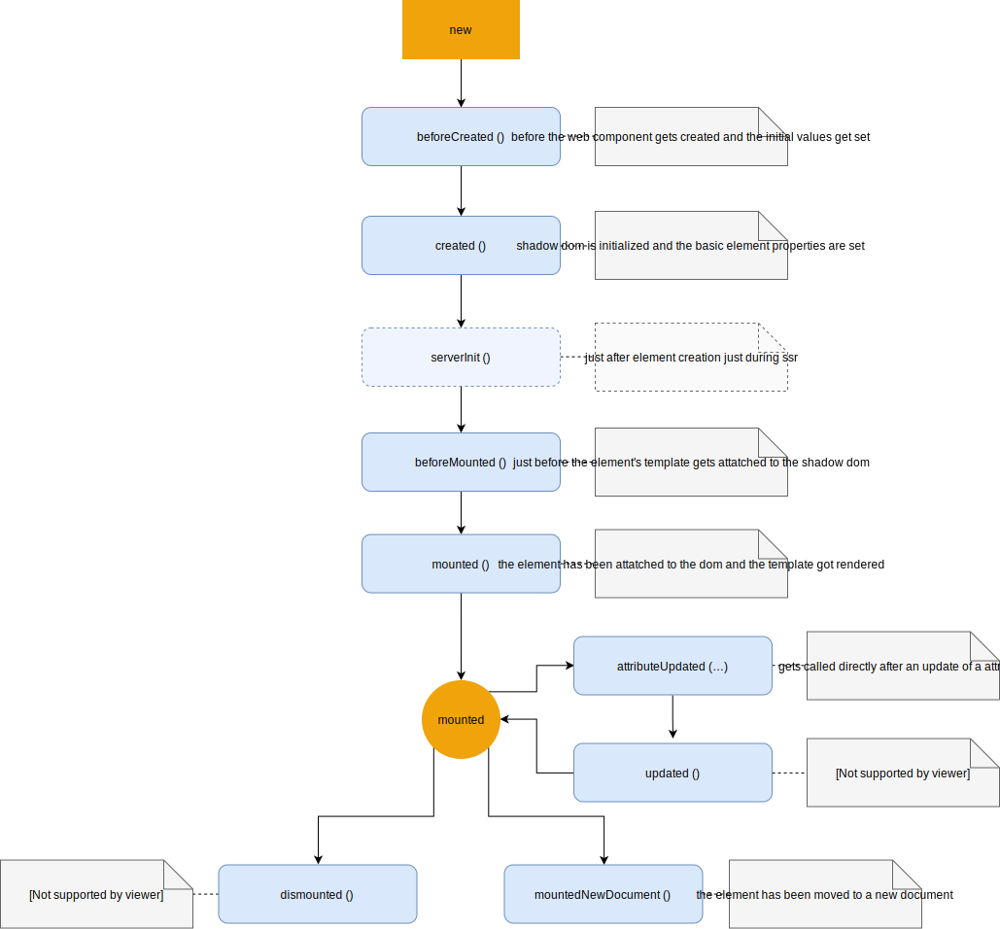

# BaseClass

A simple BaseClass for creating native web components with built-in lifecycle and templating!


## Functionality

* for-loops in template with `${this.Repeat(…)}`
* conditional attributes, … with `?disabled=${this.isDisabled}`
* build-in lifecycle-methods
* native javascript expressions
* computed properties with native methods `<span>${this.getInfotext ()}</span>`
* events / actions with `@click="${ () => this.buttonClickedEvent () }"`


## Example

Creating a custom web component is as easy as inherit from the BaseElement-Class and implementing the basic getter `template (), attributes () and dataAttributes ()` function. There you can define the template and optionally the style, attributes and data-attributes.

```
import BaseElement from './src/base-element.js'

class CustomButton extends BaseElement {

    get template () {
            return this.Template`
            <style>
                input {
                    border: ${this.BorderNumber ()}px solid black;
                }
            </style>
            <input ?disabled=${this.disabled} type="number" value=${this.number} name="number" /> <slot></slot>: <b>${this.number}</b>
            
            <ul>
                ${this.Repeat(
                this.list.slice (0, this.number),
                (item, idx) => this.list [idx],
                (item, idx) => this.Template`
                  <li style="background-color: ${ idx % 2 === 0 ? '#d3d3d3' : 'red' }" >${item}</li>
                `
            )}
            </ul>
            
            <button @click="${() => this.ToggleButtonClicked ()}">Toggle!</button>
        `;
        }
    
        get attributes () {
    
            let list = [];
            for (let i = 0; i <= this.MaxNumber; i++)
                list.push (`List entry no. ${i+1}`);
    
            return {
                'number': 11,
                'list': list,
                'disabled': true,
            };
        }
    
        get dataAttributes () {
            return [
                'number'
            ];
        }
}
```


## getter methods

With the init function you define the new web component. 
You have to define a template, otherwise simply the slot's content will be displayed.

Additionally you can define some component attributes which will be updated automatically when changing them via javascript or otherwise.

Because of the structure of web components (custom elements with shadow root), the form-input elements will not be recognized by default by forms. So they do not send them with the "normal" input-fields. The encapsulation of the shadow dom is the reason for that. Because of that the base-class automatically creates hidden elements for each attribute defined in `componentDataAtrribtues`. So the defined attributes will be recognized by forms.


### methods

* `get template () {…} - lit-html template literal` - the templat  of the component with also inline commands for js {{ 2+6 }} or {{ this.customAttribute }}
* `get attributes () {…} - object` - the attributes this component should support (all usings in template will automatically update)
* `get dataAttributes () {…} - array` - the attributes which should be recognized by forms


## component lifecycle 


